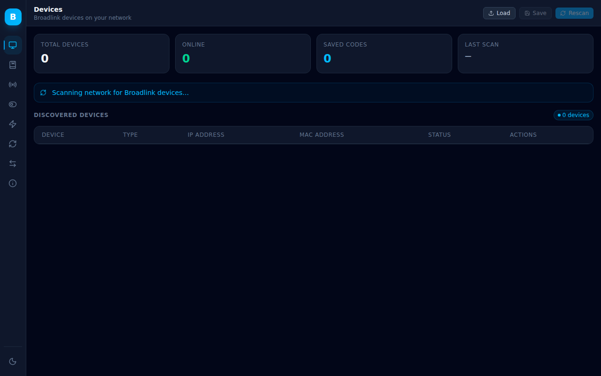
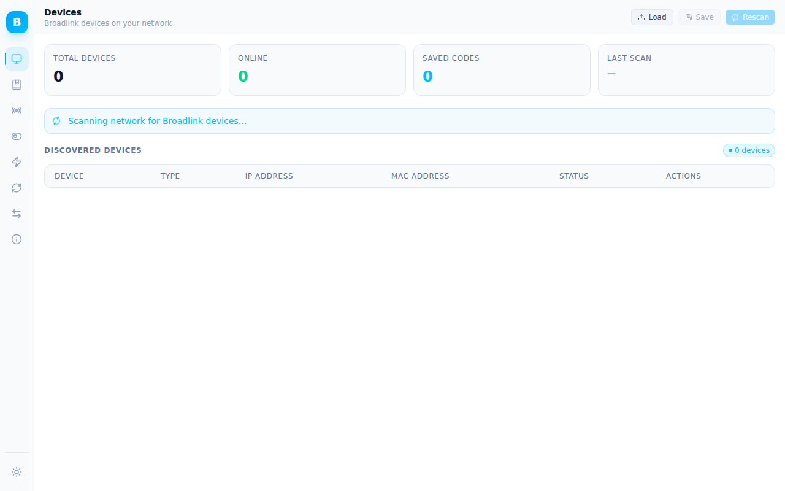
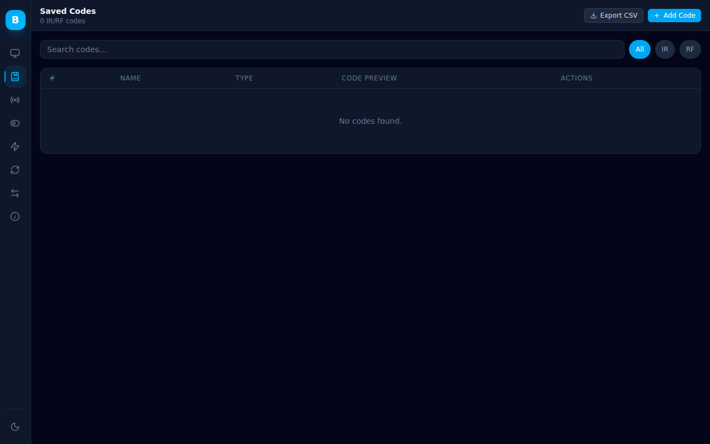
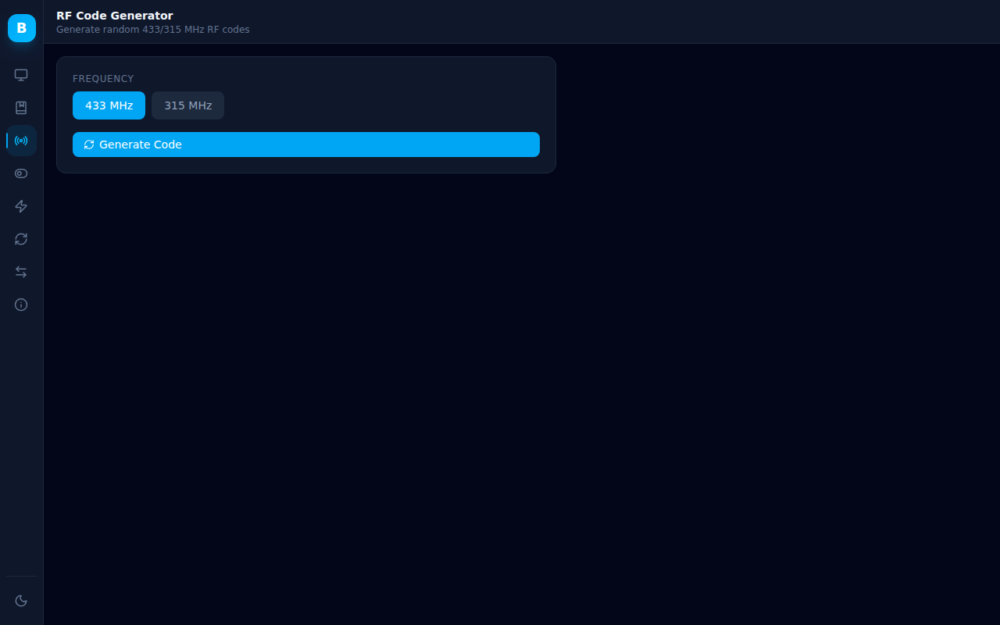
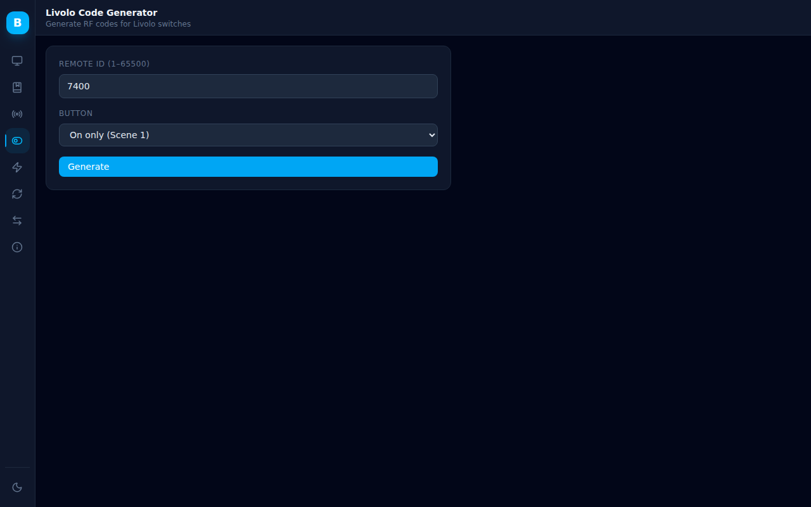
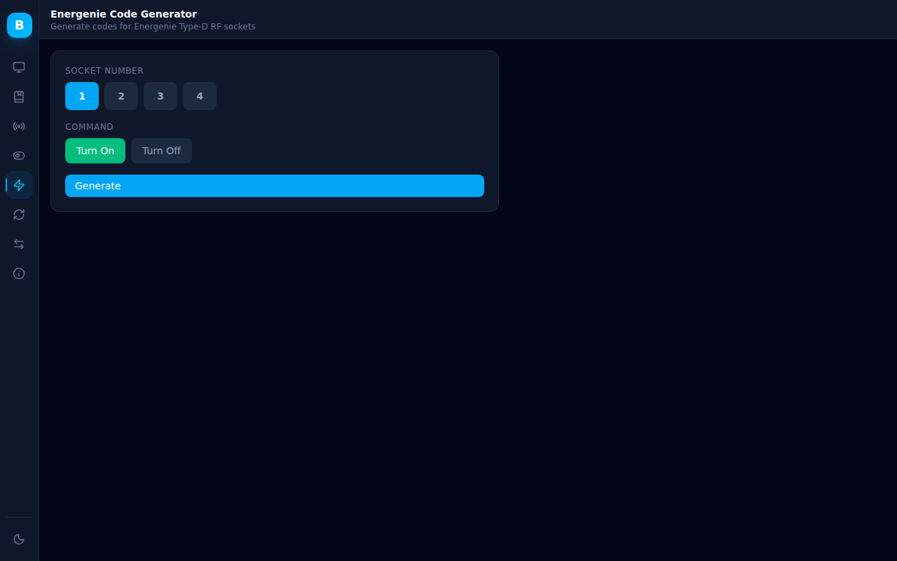
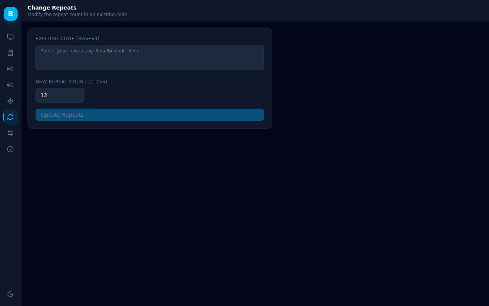
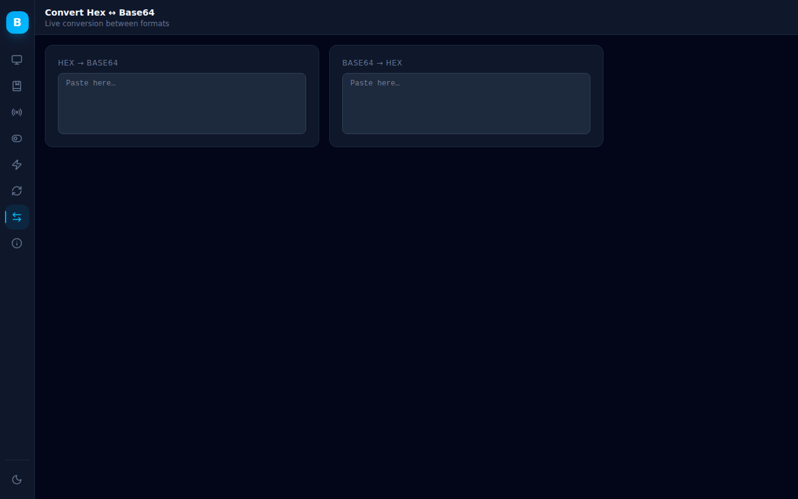
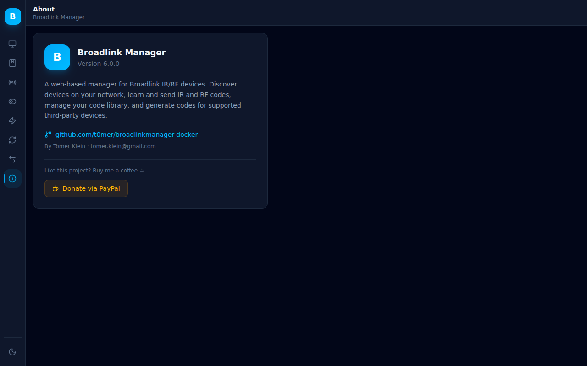

*Please :star: this repo if you find it useful*

<p align="left"><br>
 <a href="https://www.paypal.com/paypalme/techblogil?locale.x=he_IL" target="_blank"></a>
</p>

# BroadlinkManager  

BroadlinkManager is a [FastAPI](https://fastapi.tiangolo.com/) powered web application that makes it easy to manage Broadlink IR/RF devices on your local network. It features a modern React UI with dark and light mode support, a full REST API, and runs as a single Docker container.

## Features

- **Device Discovery** — automatically scan your network for Broadlink devices; save and reload device lists
- **IR Code Learning & Sending** — put any supported device into IR learning mode and capture codes; send saved codes with one click
- **RF Code Learning & Sending** — guided 3-step RF sweep (hold → press → save) with real-time status polling
- **Saved Codes Library** — store, search, filter (IR/RF), edit, delete, and export your code collection as CSV
- **RF Code Generator** — generate random 433 MHz or 315 MHz RF codes (regular and long-repeat variants)
- **Livolo Code Generator** — generate RF codes for Livolo smart switches by remote ID and button type
- **Energenie Code Generator** — generate codes for Energenie Type-D 433 MHz RF sockets
- **Change Repeats** — modify the repeat count of any existing Base64-encoded IR or RF code
- **Hex ↔ Base64 Converter** — live bidirectional conversion between hex and Base64 code formats
- **Dark / Light Mode** — toggle between dark and light themes; preference is persisted across sessions
- **Mobile Friendly** — responsive layout with collapsible sidebar navigation
- **REST API + Swagger UI** — full OpenAPI documentation at `/docs`
- **Prometheus Metrics** — built-in metrics endpoint at `/metrics`

## Installation

### Docker Compose (recommended)

```yaml
services:
  broadlinkmanager:
    image: techblog/broadlinkmanager
    container_name: broadlinkmanager
    restart: unless-stopped
    ports:
      - "7020:7020"
    volumes:
      - ./data:/app/data
    environment:
      - DISCOVERY_DST_IP=192.168.1.255   # set to your subnet broadcast
```

> **Docker Desktop (Windows/Mac):** the default bridge/NAT network blocks UDP broadcast, so the scan will find nothing without extra configuration. Set `DISCOVERY_DST_IP` to your subnet broadcast address and/or specific device IPs (e.g. `192.168.1.255,192.168.1.199`) — unicast replies route back through NAT conntrack.

> **Linux hosts:** for the simplest setup replace `ports:` with `network_mode: host` so the container joins the host network directly and broadcast discovery works with no extra config.

Once the container is running, open your browser at:
```
http://<docker-host-ip>:7020
```

### Environment Variables

| Variable | Default | Description |
|---|---|---|
| `DISCOVERY_IP_LIST` | *(auto-detected)* | Comma-separated list of local IP addresses to use for device discovery. Useful when the container has multiple network interfaces. Example: `192.168.1.10,192.168.2.10` |
| `DISCOVERY_DST_IP` | `255.255.255.255` | Comma-separated list of destination addresses for the discovery packet: broadcast addresses and/or specific device IPs. Example: `192.168.1.255,192.168.1.199` |
| `DISCOVERY_TIMEOUT` | `5` | Discovery timeout in seconds per scan |
| `DB_PATH` | `/app/data/codes.db` | Path to the SQLite database file for saved codes |

### CLI Flags

You can pass arguments directly to the container to override discovery behaviour:

| Flag | Default | Description |
|---|---|---|
| `--ip <IP>` | *(auto)* | Specify a local interface IP for discovery (repeatable) |
| `--dst-ip <IP[,IP…]>` | `255.255.255.255` | Comma-separated destination addresses for discovery (broadcast and/or device IPs) |
| `--timeout <s>` | `5` | Discovery timeout in seconds |

Example:
```yaml
command: ["python", "server.py", "--ip", "192.168.1.50"]
```

## Screenshots

### Devices — Dark Mode
[](screenshots/new/devices-dark.png)

### Devices — Light Mode
[](screenshots/new/devices-light.png)

### Saved Codes
[](screenshots/new/saved-codes.png)

### RF Code Generator
[](screenshots/new/rf-generator.png)

### Livolo Code Generator
[](screenshots/new/livolo.png)

### Energenie Code Generator
[](screenshots/new/energenie.png)

### Change Repeats
[](screenshots/new/repeats.png)

### Hex ↔ Base64 Converter
[](screenshots/new/convert.png)

### About
[](screenshots/new/about.png)

## Supported Devices

| Family | Models |
|---|---|
| **SP1** | SP1 |
| **SP2** | SP2, SP mini, SP2-compatible (Honeywell, URANT), NEO (Ankuoo), SP mini 3, MP2, SP2-CL, SC1 |
| **SP2S** | SP2, NEO PRO (Ankuoo), Ego (Efergy), SP mini+ |
| **SP3** | SP3, SP3-EU |
| **SP3S** | SP3S-US, SP3S-EU |
| **SP4** | SP4L-CN/EU/AU/UK/US, SP4M, MCB1, SCB1E, SCB2, SP mini 3 |
| **RM mini** | RM mini, RM mini 3 (all variants) |
| **RM pro** | RM pro/pro+, RM home, RM plus |
| **RM mini B** | RM mini 3 (0x5F36, 0x6507, 0x6508) |
| **RM4 mini** | RM4 mini, RM4C mini, RM4S, RM4 TV mate, RM4C mate |
| **RM4 pro** | RM4 pro, RM4C pro |
| **Sensors** | e-Sensor (A1) |
| **Lights** | LB1, LB26 R1, LB27 R1, SB500TD, SB800TD |
| **Alarm** | S2KIT, S3 |
| **Climate** | HY02/HY03 (Hysen) |
| **Cover** | DT360E-45/20 (Dooya) |
| **BG Electrical** | BG800/BG900, AHC/U-01 |

## REST API

Interactive API documentation is available at `http://<host>:7020/docs` (Swagger UI).

Key endpoints:

| Method | Path | Description |
|---|---|---|
| GET | `/autodiscover` | Scan network for Broadlink devices |
| GET | `/device/ping?host=<ip>` | Check if a device is online |
| POST | `/devices/save` | Save discovered device list to file |
| GET | `/devices/load` | Load device list from file |
| GET | `/ir/learn` | Start IR learning on a device |
| GET | `/rf/learn` | Start RF sweep on a device |
| GET | `/rf/status` | Poll RF learning status |
| GET | `/rf/continue` | Continue RF sweep after frequency lock |
| GET | `/command/send` | Send IR/RF code to a device |
| GET | `/temperature` | Read temperature from a sensor device |
| GET | `/api/codes` | List all saved codes |
| POST | `/api/code` | Save a new code |
| PUT | `/api/code/{id}` | Update a saved code |
| DELETE | `/api/code/{id}` | Delete a saved code |
| GET | `/api/version` | Get application version |
| GET | `/metrics` | Prometheus metrics |

## Credits

- [Matthew Garrett](https://github.com/mjg59) — [python-broadlink](https://github.com/mjg59/python-broadlink)
- [Dima Goltsman](https://github.com/dimagoltsman) — [Random-Broadlink-RM-Code-Generator](https://github.com/dimagoltsman/Random-Broadlink-RM-Code-Generator)

## Donation

If you find this project useful, consider buying me a coffee ☕

<p align="left">
 <a href="https://www.paypal.com/paypalme/techblogil?locale.x=he_IL" target="_blank"></a>
</p>
