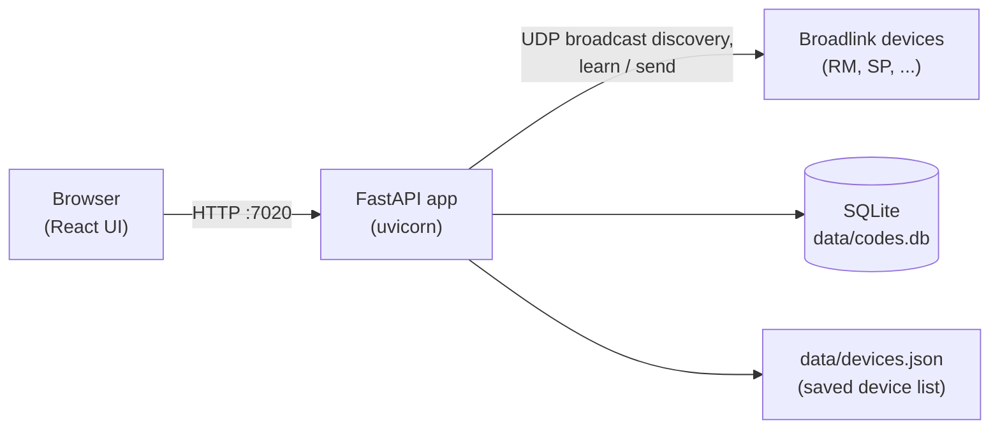

*Please :star: this repo if you find it useful*

<p align="left"><br>
 <a href="https://www.paypal.com/paypalme/techblogil?locale.x=he_IL" target="_blank"></a>
</p>

# BroadlinkManager  

BroadlinkManager is a self-hosted web application for managing Broadlink IR/RF devices on your local network. It discovers Broadlink devices, learns and sends IR and RF codes, keeps a searchable library of saved codes, and includes generators and converters for common RF code formats. The backend is built with [FastAPI](https://fastapi.tiangolo.com/) and the bundled [python-broadlink](https://github.com/mjg59/python-broadlink) library; the UI is a React single-page app with dark and light themes. It runs as a single Docker container or as a Home Assistant add-on.

## Table of Contents

- [Features](#features)
- [Screenshots](#screenshots)
- [How It Works](#how-it-works)
- [Requirements](#requirements)
- [Installation](#installation)
- [Configuration](#configuration)
- [Usage](#usage)
- [Supported Devices](#supported-devices)
- [REST API](#rest-api)
- [Using Codes in Home Assistant](#using-codes-in-home-assistant)
- [Security Notes](#security-notes)
- [Troubleshooting](#troubleshooting)
- [Development](#development)
- [Contributing](#contributing)
- [Credits](#credits)
- [License](#license)
- [Donation](#donation)

## Features

- **Device Discovery** — scan your network for Broadlink devices; save the device list to a file and reload it later
- **Online Status** — each discovered device is pinged every 30 seconds and shown as online or offline
- **IR Code Learning & Sending** — put a device into IR learning mode, capture a code (30-second window), and send it with one click
- **RF Code Learning & Sending** — guided 3-step RF sweep (hold → press → save) with real-time status polling
- **Temperature Reading** — read the temperature from supported devices through the API (`/temperature`). The thermometer button on the Devices page currently opens the Send panel instead of reading the temperature.
- **Saved Codes Library** — store codes (IR/RF) in a SQLite database; add codes manually, search, filter by type, edit, delete, send a code to a chosen device, and export them as CSV
- **RF Code Generator** — generate random 433 MHz or 315 MHz RF codes (regular and long-repeat variants)
- **Livolo Code Generator** — generate RF codes for Livolo smart switches by remote ID and button code
- **Energenie Code Generator** — generate codes for Energenie Type-D 433 MHz RF sockets
- **Change Repeats** — change the repeat count of an existing Base64-encoded IR or RF code
- **Hex ↔ Base64 Converter** — live bidirectional conversion between hex and Base64 code formats
- **Dark / Light Mode** — follows your system preference by default; your choice is saved in the browser
- **Mobile Friendly** — responsive layout with collapsible sidebar navigation
- **REST API + Swagger UI** — interactive OpenAPI documentation at `/docs`
- **Prometheus Metrics** — HTTP request metrics at `/metrics`

## Screenshots

### Devices — Dark Mode
[](screenshots/new/devices-dark.png)

### Devices — Light Mode
[](screenshots/new/devices-light.png)

### Saved Codes
[](screenshots/new/saved-codes.png)

### RF Code Generator
[](screenshots/new/rf-generator.png)

### Livolo Code Generator
[](screenshots/new/livolo.png)

### Energenie Code Generator
[](screenshots/new/energenie.png)

### Change Repeats
[](screenshots/new/repeats.png)

### Hex ↔ Base64 Converter
[](screenshots/new/convert.png)

### About
[](screenshots/new/about.png)

<!-- TODO: screenshot — the device command panel (Learn IR / Learn RF / Send tabs) is not shown -->

## How It Works


```mermaid
flowchart LR
    Browser["Browser<br/>(React UI)"] -- "HTTP :7020" --> API["FastAPI app<br/>(uvicorn)"]
    API -- "UDP broadcast discovery,<br/>learn / send" --> Devices["Broadlink devices<br/>(RM, SP, ...)"]
    API --> DB[("SQLite<br/>data/codes.db")]
    API --> JSON["data/devices.json<br/>(saved device list)"]
```

- A single Python process (`broadlinkmanager.py`) starts uvicorn on port **7020**. It serves the REST API and the built React app from the same origin.
- Discovery sends UDP broadcast packets from each local interface IP (see [Configuration](#configuration)), then authenticates every device that answers.
- Learned codes are returned as **hex** strings. The code generators and the Change Repeats tool work with **Base64** (the format Home Assistant uses). The Convert page translates between the two.
- Saved codes are stored in a SQLite database (`codes.db`); the device list can be saved to `devices.json`. Both live in the `data/` directory next to the application.
- The code generators (RF, Livolo, Energenie), Change Repeats, and the converter run entirely in the browser.

## Requirements

- A Broadlink device (see [Supported Devices](#supported-devices)) on the same local network and subnet as the host running BroadlinkManager
- Docker (with host networking), **or** Home Assistant OS / Supervised for the add-on, **or** Python 3.12 and Node.js 20.19+ (or 22.12+) to build and run from source
- The host must be able to send and receive UDP broadcasts on the LAN for discovery

## Installation

> **Published image status:** the newest image on Docker Hub is `techblog/broadlinkmanager:6.0.0` (also tagged `latest`), published in July 2024. It predates the React UI described in this README: it ships the older server-rendered UI and stores its data in `/opt/broadlinkmanager/data` instead of `/app/data`. The Docker snippets below target that published image. Paths under `/app/data` apply only to images built from the current source. <!-- TODO: verify — update this note once a new image is published -->

### Docker Compose (recommended)

```yaml
services:
  broadlinkmanager:
    image: techblog/broadlinkmanager:6.0.0   # same as latest
    container_name: broadlinkmanager
    network_mode: host
    restart: unless-stopped
    volumes:
      - ./data:/opt/broadlinkmanager/data   # use ./data:/app/data for an image built from current source
```

> **Why `network_mode: host`?** Broadlink device discovery uses UDP broadcast packets on the local network. Host networking allows the container to send and receive those broadcasts. Without it, auto-discovery will not find any devices.

Once the container is running, open your browser at:

```
http://<docker-host-ip>:7020
```

### Docker CLI

```bash
docker run -d \
  --name broadlinkmanager \
  --network host \
  --restart unless-stopped \
  -v "$(pwd)/data:/opt/broadlinkmanager/data" \
  techblog/broadlinkmanager:6.0.0
```

For an image built from the current source, mount `/app/data` instead.

Images are built for `linux/amd64`, `linux/arm64`, and `linux/arm/v7`.

### Home Assistant Add-on

This repository is also a Home Assistant add-on repository (see `repository.yaml` and `config.yaml`).

1. In Home Assistant, go to **Settings → Add-ons → Add-on Store**.
2. Open the **⋮** menu → **Repositories** and add:
   ```
   https://github.com/t0mer/broadlinkmanager-docker
   ```
3. Install **Broadlink Manager**, then start it.
4. Open the web UI from the add-on page, or browse to `http://<home-assistant-ip>:7020`.

The add-on runs with host networking (so discovery works), exposes port `7020/tcp`, supports `aarch64`, `amd64`, `armhf` <!-- TODO: verify armhf build (python:3.12-slim) -->, and `armv7`, and adds a **Broadlink Manager** entry to the sidebar (ingress). <!-- TODO: verify — ingress with the React UI (absolute /assets paths) has not been confirmed to work -->

> **Add-on caveats:** `config.yaml` has no `image:` key, so the Supervisor builds the add-on locally from this repository's `Dockerfile` (which currently may not produce a working image — see [Development](#development)). There is also no `map:` entry and the app stores its data in `/app/data` inside the container, not in the add-on's persistent `/data`, so saved codes and the saved device list are lost when the add-on is rebuilt or updated.

### Build from Source

```bash
git clone https://github.com/t0mer/broadlinkmanager-docker.git
cd broadlinkmanager-docker

# Build the React UI (output goes to broadlinkmanager/dist)
cd broadlinkmanager/web
npm ci
npm run build
cd ..

# Install Python dependencies and run
pip install -r requirements.txt cryptography
mkdir -p data
python broadlinkmanager.py
```

The vendored `broadlink` library needs the `cryptography` package, which is not listed in `broadlinkmanager/requirements.txt`, so it is installed explicitly above. The `data/` directory must exist before start-up, because the SQLite database is created there.

## Configuration

### Environment Variables

| Variable | Default | Description |
|---|---|---|
| `DISCOVERY_IP_LIST` | *(auto-detected with `hostname -I`)* | Comma-separated list of local IP addresses to discover from. Useful when the host has multiple network interfaces. Example: `192.168.1.10,192.168.2.10`. Ignored when `--ip` is given. |
| `DB_PATH` | `<app dir>/data/codes.db` (`/app/data/codes.db` in the container) | Path to the SQLite database file for saved codes. Current source only; the published 6.0.0 image always uses `data/codes.db` (`/opt/broadlinkmanager/data/codes.db`). |

### CLI Flags

You can pass arguments to `broadlinkmanager.py` to override discovery behaviour:

| Flag | Default | Description |
|---|---|---|
| `--ip <IP>` | *(auto)* | Local interface IP to discover from. Repeatable. Takes precedence over `DISCOVERY_IP_LIST`. |
| `--dst-ip <IP>` | `255.255.255.255` | Destination address for discovery broadcasts |
| `--timeout <s>` | `5` | Accepted, but currently not used: discovery always waits 5 seconds <!-- TODO: verify --> |

Arguments can also be read from a file with the `@` prefix (for example `python broadlinkmanager.py @args.txt`).

Discovery interfaces are resolved in this order: `--ip` flags → `DISCOVERY_IP_LIST` → all addresses from `hostname -I`.

Example (Docker Compose, published 6.0.0 image — its entrypoint is already `python3 broadlinkmanager.py`, so pass only the flags):

```yaml
command: ["--ip", "192.168.1.50"]
```

For an image built from the current source (which has no entrypoint), use the full form:

```yaml
command: ["python", "broadlinkmanager.py", "--ip", "192.168.1.50"]
```

### Fixed Settings

| Setting | Value |
|---|---|
| Listen address / port | `0.0.0.0:7020` (not configurable) |
| Devices file | `<app dir>/data/devices.json` |
| IR / RF learning timeout | 30 seconds |

### Home Assistant Add-on Options

`config.yaml` declares the options `ssl` (default `false`), `certfile` (default `fullchain.pem`), `keyfile` (default `privkey.pem`), and `log_level`. The application does not read any of them, so changing them has no effect. <!-- TODO: verify -->

### Persistent Data

| Path (current source) | Path (published 6.0.0 image) | Contents |
|---|---|---|
| `/app/data/codes.db` | `/opt/broadlinkmanager/data/codes.db` | SQLite database of saved codes |
| `/app/data/devices.json` | `/opt/broadlinkmanager/data/devices.json` | Device list saved from the Devices page |

With Docker, mount the data directory as a volume so your codes survive container updates. This does not apply to the Home Assistant add-on (see the add-on caveats above).

## Usage

1. **Discover devices.** The **Devices** page scans the network when it opens. Use **Rescan** to scan again, **Save** to write the current list to `devices.json`, and **Load** to restore it without scanning.
2. **Open the command panel.** Click a device's **IR**, **RF**, or **Send** button to open the side panel with the **IR Code**, **RF Code**, and **Send** tabs. The buttons are disabled while the device is offline.
3. **Learn an IR code.** Click **Learn IR**, point the remote at the Broadlink device, and press the button within 30 seconds. Name the captured code and save it, or copy it.
4. **Learn an RF code.** Start the sweep, then press and hold the remote button until the frequency is found. Release the button, click **Continue Sweep**, then press the button once to capture the code. Name it and save it.
5. **Send a code.** Paste a hex code, or pick one from your saved codes, and click **Send**.
6. **Manage saved codes.** The **Saved Codes** page lists all codes (10 per page), with search by name, an IR/RF filter, edit, delete, and **Export CSV**. **Add Code** stores a code entered by hand (the form accepts Base64 or hex, but sending only works with hex). The per-code send button sends a saved code to a device you pick.
7. **Generate and convert codes.** Use **RF Generator**, **Livolo**, **Energenie**, **Repeats**, and **Convert** from the sidebar. These tools produce Base64 codes.

## Supported Devices

| Family | Models |
|---|---|
| **SP1** | SP1 |
| **SP2** | SP2, SP mini, SP2-compatible (Honeywell, URANT), NEO (Ankuoo), SP mini 3, MP2, SP2-CL, SC1 |
| **SP2S** | SP2, NEO PRO (Ankuoo), Ego (Efergy), SP mini+ |
| **SP3** | SP3, SP3-EU |
| **SP3S** | SP3S-US, SP3S-EU |
| **SP4** | SP4L-CN/EU/AU/UK/US, SP4M, SP4M-US, MCB1, SCB1E, SCB2, SP mini 3 |
| **RM mini** | RM mini, RM mini 3 (all variants) |
| **RM pro** | RM pro/pro+, RM home, RM plus |
| **RM mini B** | RM mini 3 (0x5F36, 0x6507, 0x6508) |
| **RM4 mini** | RM4 mini, RM4C mini, RM4S, RM4 TV mate, RM4C mate |
| **RM4 pro** | RM4 pro, RM4C pro |
| **Sensors** | e-Sensor (A1) |
| **Lights** | LB1, LB26 R1, LB27 R1, SB500TD, SB800TD |
| **Power strips** | MP1 (MP1-1K4S, MP1-1K3S2U) — supported by the bundled library, but shown as "Not Supported" in the UI because they are missing from the app's device name list |
| **Alarm** | S2KIT |
| **Hub** | S3 |
| **Climate** | HY02/HY03 (Hysen) |
| **Cover** | DT360E-45/20 (Dooya) |
| **BG Electrical** | BG800/BG900, AHC/U-01 |

IR/RF learning and sending need a remote-capable device (RM family). RF learning requires an RF-capable model (for example RM pro or RM4 pro).

## REST API

Interactive API documentation is available at `http://<host>:7020/docs` (Swagger UI). Some endpoints used by the UI are hidden from Swagger; they are included below.

Device endpoints take the device parameters returned by `/autodiscover` as query parameters: `host` (IP), `mac` (hex, no separators), and `type` (device type, e.g. `0x5f36`).

| Method | Path | Parameters | Description |
|---|---|---|---|
| GET | `/autodiscover` | `freshscan` (`1` = scan, default; `0` = return saved list if present) | Discover Broadlink devices |
| GET | `/device/ping` | `host` | Check whether a device is online |
| POST | `/devices/save` | JSON array of `{name, type, ip, mac}` | Save the device list to `devices.json` |
| GET | `/devices/load` | — | Load the saved device list |
| GET | `/ir/learn` | `host`, `mac`, `type` | Learn an IR code (waits up to 30 s); returns the code as hex |
| GET | `/rf/learn` | `host`, `mac`, `type` | Start the RF sweep; returns the code as hex when finished |
| GET | `/rf/status` | — | Poll RF learning status |
| GET | `/rf/continue` | — | Continue the RF sweep after the frequency is found |
| GET | `/command/send` | `host`, `mac`, `type`, `command` (hex) | Send an IR/RF code |
| GET | `/temperature` | `host`, `mac`, `type` | Read the temperature from a supported device |
| GET | `/api/codes` | — | List all saved codes |
| GET | `/api/code/{id}` | — | Get one saved code (returned as a one-element array) |
| POST | `/api/code` | JSON `{CodeType, CodeName, Code}` | Save a new code |
| PUT | `/api/code/{id}` | JSON `{CodeType, CodeName, Code}` | Update a saved code |
| DELETE | `/api/code/{id}` | — | Delete a saved code |
| GET | `/api/version` | — | Get the application version |
| GET | `/metrics` | — | Prometheus metrics |

Examples:

```bash
# Discover devices
curl "http://localhost:7020/autodiscover"
# [{"name": "RMmini3 (Broadlink)", "type": "0x5f36", "ip": "192.168.1.20", "mac": "a1b2c3d4e5f6"}]

# Send a hex code
curl "http://localhost:7020/command/send?host=192.168.1.20&mac=a1b2c3d4e5f6&type=0x5f36&command=2600..."
# {"data": "", "success": 1, "message": "Command sent successfully"}

# Save a code
curl -X POST "http://localhost:7020/api/code" \
  -H "Content-Type: application/json" \
  -d '{"CodeType": "IR", "CodeName": "TV Power", "Code": "2600..."}'
# {"message": "Code inserted successfully.", "success": 1}
```

## Using Codes in Home Assistant

The Home Assistant Broadlink integration sends Base64 codes. To use a code learned in BroadlinkManager (hex), convert it on the **Convert** page and send it with the `b64:` prefix:

```yaml
action: remote.send_command
target:
  entity_id: remote.living_room_rm
data:
  command: b64:JgBIAAABK5QQ...
```

Codes from the RF, Livolo, and Energenie generators and from Change Repeats are already in Base64.

## Security Notes

- There is **no authentication**. Anyone who can reach port 7020 can discover devices, send IR/RF commands, and read, change, or delete saved codes.
- CORS allows all origins (`*`), so any web page opened in a browser on your network can call the API.
- The app listens on all interfaces (`0.0.0.0`) and, with host networking, is reachable on every host IP. Keep it on a trusted LAN and do not expose it to the internet; put it behind a reverse proxy with authentication if you need remote access.

## Troubleshooting

- **No devices found** — make sure the container uses host networking and the device is on the same subnet. If the host has several interfaces, set `DISCOVERY_IP_LIST` or `--ip` to the LAN address. If broadcasts to `255.255.255.255` are blocked, try the subnet broadcast address with `--dst-ip` (for example `192.168.1.255`).
- **Device shows as "Not Supported"** — its device type ID is not in the name list. It may still work if python-broadlink supports it.
- **"Send failed" when sending a Base64 code** — the send endpoint only accepts hex. Convert Base64 codes to hex on the **Convert** page first.
- **"No Data Received" / "RF Frequency not found!"** — learning times out after 30 seconds. Start again and press the button sooner, closer to the device.
- **Saved codes disappear after an update** — with Docker, mount the data directory as a volume (see [Persistent Data](#persistent-data)). The Home Assistant add-on currently cannot keep data across rebuilds.
- **"Frontend not built yet"** — the React UI has not been built into `broadlinkmanager/dist`. Run `npm run build` in `broadlinkmanager/web`.

## Development

Project layout:

```
broadlinkmanager/
├── broadlinkmanager.py   # entry point — starts uvicorn on :7020
├── app/
│   ├── main.py           # FastAPI app, routers, SPA fallback, /metrics
│   ├── config.py         # CLI args, discovery interfaces, paths
│   ├── db.py             # SQLite access (DB_PATH)
│   ├── state.py          # RF sweep state
│   └── routers/          # devices, commands, codes
├── broadlink/            # vendored python-broadlink library
├── web/                  # React + TypeScript + Vite + Tailwind UI
├── dist/                 # built UI (generated)
└── VERSION
config.yaml, repository.yaml   # Home Assistant add-on metadata
Dockerfile                     # multi-stage build (Node → Python)
```

Run the backend and the UI dev server with hot reload:

```bash
# Terminal 1 — backend on :7020
cd broadlinkmanager
pip install -r requirements.txt cryptography
mkdir -p data
python broadlinkmanager.py

# Terminal 2 — UI on :5173 (proxies API calls to :7020)
cd broadlinkmanager/web
npm ci
npm run dev
```

Lint the UI with `npm run lint`. The application version is read from `broadlinkmanager/VERSION`.

Build the Docker image locally:

```bash
docker build -t broadlinkmanager .
```

<!-- TODO: verify — the current Dockerfile has no CMD/ENTRYPOINT, does not copy the built UI from the frontend stage, and does not install `cryptography`, so the resulting image may not start -->

## Contributing

Issues and pull requests are welcome at [github.com/t0mer/broadlinkmanager-docker](https://github.com/t0mer/broadlinkmanager-docker). Please keep changes focused and describe how you tested them.

## Credits

- [Matthew Garrett](https://github.com/mjg59) — [python-broadlink](https://github.com/mjg59/python-broadlink)
- [Dima Goltsman](https://github.com/dimagoltsman) — [Random-Broadlink-RM-Code-Generator](https://github.com/dimagoltsman/Random-Broadlink-RM-Code-Generator)

## License

This project is licensed under the [Apache License 2.0](LICENSE).

## Donation

If you find this project useful, consider buying me a coffee ☕

<p align="left">
 <a href="https://www.paypal.com/paypalme/techblogil?locale.x=he_IL" target="_blank"></a>
</p>
